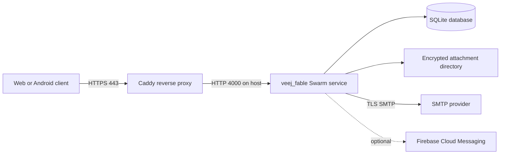

# Installation and server setup

This guide covers a new veejr development installation and the production
topology currently used by the project: Phoenix on Docker Swarm, Caddy for
public HTTPS, SQLite and attachment storage on persistent host paths, and an
external SMTP provider. Postfix is optional.

The repository does not yet contain an immutable application image. The
documented production path bind-mounts a checked-out repository into the
official Elixir image and runs `mix phx.server`. Pin the Elixir image digest in
serious deployments and follow [OPERATIONS.md](OPERATIONS.md) for every update.

## Topology



Caddy is the only service that should be reachable from the public Internet.
Port 4000 may be published on the host so Caddy can reach Phoenix, but it
should not be forwarded by the router or opened on an untrusted firewall.

## Requirements

For local development:

- Git.
- Elixir 1.15 or newer and OTP 26 or newer.
- Native build tools required by `bcrypt_elixir`.

For the tested production arrangement:

- A machine that remains powered on.
- Docker Engine in Swarm mode, or Docker Desktop on Windows.
- A public DNS name whose A/AAAA record points to the public address.
- Router and host-firewall access for TCP 80 and TCP 443. UDP 443 is optional
  and enables HTTP/3 through Caddy.
- An SMTP account or relay permitted to send from `MAIL_FROM_ADDRESS`.
- A backup destination outside the application host.

Dynamic DNS is acceptable. If the router does not support NAT loopback, add a
split-DNS record that resolves the public veejr hostname to the server's LAN
address for local clients.

## Local development

Clone the repository and install its dependencies:

```sh
git clone https://github.com/veejr/veejr-server.git
cd veejr-server
mix setup
mix phx.server
```

Open <http://localhost:4000>. Development email is captured at
<http://localhost:4000/dev/mailbox>.

The development endpoint listens on LAN interfaces by default. Use
`BIND_ALL=false mix phx.server` to restrict it to loopback. Camera, microphone,
WebCrypto, service-worker, and push behavior should be tested through HTTPS;
plain HTTP on a LAN address is not a secure browser context.

Verify a development installation with:

```sh
mix compile --warnings-as-errors
mix test
mix precommit
```

## Production directories

Keep runtime data and secrets outside the repository. The examples below use
Windows PowerShell and these locations:

```powershell
$Repo = "C:\Services\veejr-server"
$State = "C:\ProgramData\Veejr"
$Data = "$State\data"
$Secrets = "$State\secrets"

New-Item -ItemType Directory -Force $Repo, $Data, "$Data\uploads", $Secrets
git clone https://github.com/veejr/veejr-server.git $Repo
```

On Linux, use absolute paths such as `/opt/veejr/server` and
`/var/lib/veejr`. The container must be able to write the database directory
and attachment directory.

## Production environment

Create `$Secrets\veejr.env`. Do not place this file in the repository. Restrict
its ACL to the deployment operator, Administrators, and SYSTEM.

```dotenv
MIX_ENV=prod
PHX_HOST=veejr.example.com
PORT=4000
VEEJR_MODE=community
DATABASE_PATH=/var/lib/veejr/veejr_prod.db
VEEJR_BLOB_DIR=/var/lib/veejr/uploads
VEEJR_MIGRATION_DIR=/var/lib/veejr/migrations
POOL_SIZE=5
SECRET_KEY_BASE=replace-with-a-long-random-value
VEEJR_PROVISIONER_TOKEN=omit-unless-running-the-host-provisioner

MAIL_FROM_NAME=Veejr
MAIL_FROM_ADDRESS=veejr@example.com
SMTP_HOST=smtp.example.com
SMTP_PORT=587
SMTP_USERNAME=veejr@example.com
SMTP_PASSWORD=replace-with-the-smtp-secret
SMTP_AUTH=always
SMTP_TLS=always
SMTP_SSL=false
```

Runtime variables:

| Variable | Required | Meaning |
| --- | --- | --- |
| `DATABASE_PATH` | Production | Absolute SQLite path inside the container. |
| `SECRET_KEY_BASE` | Production | Long-lived Phoenix cookie/session secret. |
| `PHX_HOST` | Production | Public hostname only, without scheme or path. |
| `MAIL_FROM_ADDRESS` | Production | Envelope/from address accepted by the SMTP provider. |
| `SMTP_HOST` | Production | SMTP provider or private relay hostname. |
| `SMTP_PORT` | No | Defaults to `587`. |
| `SMTP_USERNAME` / `SMTP_PASSWORD` | Provider-dependent | Authenticated SMTP credentials. |
| `SMTP_AUTH` | No | `always` by default; use `never` only for a trusted private relay. |
| `SMTP_TLS` | No | `always` by default; also accepts `if_available` or `never`. |
| `SMTP_SSL` | No | Set `true` for implicit TLS, commonly on port 465. |
| `VEEJR_MODE` | No | `community` by default; `personal` restricts later registration. |
| `VEEJR_BLOB_DIR` | No | Encrypted attachment path; defaults to `/var/lib/veejr/uploads`. |
| `VEEJR_MIGRATION_DIR` | No | Private account-move packages; defaults to `/var/lib/veejr/migrations`. Never serve this directory publicly. |
| `VEEJR_PROVISIONER_TOKEN` | No | Enables the protected host-provisioner API. Use at least 32 random characters. |
| `POOL_SIZE` | No | SQLite connection-pool size; defaults to `5`. |
| `PORT` | No | Phoenix HTTP port; defaults to `4000`. |
| `FCM_SERVICE_ACCOUNT_JSON_FILE` | No | Mounted Firebase service-account path for Android push. |
| `DNS_CLUSTER_QUERY` | No | DNS cluster query for advanced multi-node deployments. Do not scale SQLite above one writer. |
| `PHX_SERVER` | Releases only | Set `true` when starting a built `mix release`; `mix phx.server` does not need it. |

Generate `SECRET_KEY_BASE` once and preserve it across upgrades and restores:

```powershell
docker run --rm elixir:1.20-otp-28 `
  elixir -e ':crypto.strong_rand_bytes(64) |> Base.encode64() |> IO.puts()'
```

Use `VEEJR_MODE=personal` when only the first account should register freely
and later accounts should require invitations. The first local account becomes
the permanent instance administrator in either mode.

### SMTP choices

Direct authenticated SMTP is the recommended starting point. For Gmail, use
`smtp.gmail.com`, port `587`, `SMTP_TLS=always`, and a Google App Password from
an account with two-step verification. Do not use the normal account password.
For a custom domain, use the SMTP service approved by that domain and configure
SPF, DKIM, and DMARC with the provider.

Postfix is optional. It is useful when several local applications share one
outbound relay or when mail must be queued independently of Phoenix. If used:

- Bind it only to a private Docker network or trusted host interface.
- Configure an upstream authenticated relay unless the server has suitable
  mail reputation and correct forward/reverse DNS.
- Never expose an unauthenticated relay to the Internet.
- Point `SMTP_HOST` and `SMTP_PORT` at Postfix and set `SMTP_AUTH`/`SMTP_TLS`
  to match the connection between Phoenix and Postfix.
- Pin a tested `boky/postfix` version rather than using `latest`; follow the
  image's upstream configuration documentation.

The current project host sends directly through an external SMTP provider.
Its existing `veej_postfix` container is not required by the application.

## Initialize Docker Swarm

Run this once on a single-node installation:

```powershell
docker swarm init
```

If Swarm is already active, Docker reports that the node is already part of a
swarm; no further initialization is needed.

## Build assets and initialize SQLite

The source-mounted server does not run migrations automatically. Prepare a new
checkout with a one-shot container before creating the service:

```powershell
$Image = "elixir:1.20-otp-28"

docker run --rm `
  --env-file "$Secrets\veejr.env" `
  --mount "type=bind,source=$Repo,target=/app" `
  --mount "type=bind,source=$Data,target=/var/lib/veejr" `
  --workdir /app `
  $Image `
  bash -lc "mix local.hex --force && mix local.rebar --force && mix deps.get --only prod && mix compile && mix assets.deploy && mix ecto.create && mix ecto.migrate"
```

This writes dependencies/build output into the checkout and persistent state
into `$Data`. It must finish successfully before the service is created.

## Optional Firebase secret

Android background notifications require a Firebase service-account JSON.
Keep the downloaded file outside the repository and create a Swarm secret:

```powershell
Get-Content -Raw "$Secrets\fcm-service-account.json" |
  docker secret create fcm_service_account_json -
```

Add this line to `veejr.env`:

```dotenv
FCM_SERVICE_ACCOUNT_JSON_FILE=/run/secrets/fcm_service_account_json
```

Do not use Android's `google-services.json`; it is not a server credential.
Omit the secret and environment setting when Android background push is not
needed.

## Create the Phoenix service

Create the single-replica service. SQLite requires one writer, so do not scale
this service above one replica.

```powershell
$Image = "elixir:1.20-otp-28"

docker service create `
  --name veej_fable `
  --replicas 1 `
  --env-file "$Secrets\veejr.env" `
  --mount "type=bind,source=$Repo,target=/app" `
  --mount "type=bind,source=$Data,target=/var/lib/veejr" `
  --publish "published=4000,target=4000,protocol=tcp,mode=host" `
  --restart-condition any `
  --workdir /app `
  $Image `
  bash -lc "mix local.hex --force >/dev/null && mix local.rebar --force >/dev/null && mix phx.server"
```

When Firebase is enabled, add this option before the image name:

```text
--secret source=fcm_service_account_json,target=fcm_service_account_json
```

Check startup before installing the proxy:

```powershell
docker service ls --filter name=veej_fable
docker service ps veej_fable --no-trunc
docker service logs --tail 100 veej_fable
curl.exe -I http://localhost:4000
```

A production HTTP request may redirect to the public HTTPS hostname. That is
expected because production forces canonical HTTPS URLs.

## Create the Caddy HTTPS server

Make sure public DNS points at this host and router/firewall rules forward TCP
80 and 443 to it. Use a mounted Caddyfile so additional instances can be added
without replacing the proxy:

```powershell
$Domain = "veejr.example.com"
$CaddyDir = "C:\ProgramData\Veejr\caddy"
New-Item -ItemType Directory -Force $CaddyDir
@"
$Domain {
  reverse_proxy host.docker.internal:4000
}
"@ | ForEach-Object {
  [IO.File]::WriteAllText("$CaddyDir\Caddyfile", $_, [Text.UTF8Encoding]::new($false))
}

docker volume create veej_caddy_data
docker volume create veej_caddy_config

docker run -d `
  --name veej_caddy `
  --restart unless-stopped `
  -p 80:80 `
  -p 443:443 `
  -p 443:443/udp `
  -v veej_caddy_data:/data `
  -v veej_caddy_config:/config `
  -v "${CaddyDir}\Caddyfile:/etc/caddy/Caddyfile" `
  caddy:2
```

On Linux Docker, add
`--add-host host.docker.internal:host-gateway` if that hostname is not already
available. Caddy obtains and renews the public certificate automatically. Its
`/data` volume must survive container replacement.

Verify DNS, TLS, Phoenix, and the public capabilities response:

```powershell
docker logs --tail 100 veej_caddy
curl.exe -I "https://$Domain/"
curl.exe "https://$Domain/api/v1/capabilities"
```

The capabilities response reports whether browser push and Android push are
available, but contains no secrets.

## First account

1. Open the public HTTPS URL and register the first local account.
2. Complete the email confirmation or magic-link login.
3. Create and safely record the encryption passphrase on `/keys`.
4. Open `/admin` and review registration, upload, storage, retention, and mail
   settings.
5. Create a test invitation, send a message with an attachment, and verify mail
   delivery from a second device before announcing the instance.

The first local account is the permanent instance administrator. It cannot be
deleted, suspended, or reassigned.

## Optional account-move provisioner

The Admin page can move a non-admin member into a new, isolated Veejr instance.
Phoenix creates and verifies private export packages, but it never receives
Docker access. The host-side `scripts/veejr_provisioner.ps1` process performs
disposable test imports and final Docker/Caddy provisioning.

Generate one token, store it outside the repository, and add the same value as
`VEEJR_PROVISIONER_TOKEN` in the source instance environment:

```powershell
$TokenFile = "C:\ProgramData\Veejr\secrets\provisioner.token"
$Token = docker run --rm elixir:1.20-otp-28 `
  elixir -e ':crypto.strong_rand_bytes(48) |> Base.url_encode64(padding: false) |> IO.puts()'
$Token | Set-Content $TokenFile -NoNewline
```

Create a second environment template containing the common SMTP settings and
sender identity. It may contain the normal production variables; the script
overrides hostname, port, mode, database paths, and `SECRET_KEY_BASE` for every
new instance. Do not include `VEEJR_PROVISIONER_TOKEN` in the template.

Run one provisioner process on the Docker manager host:

```powershell
powershell.exe -NoProfile -ExecutionPolicy Bypass `
  -File C:\Services\veejr-server\scripts\veejr_provisioner.ps1 `
  -SourceUrl https://veejr.example.com `
  -TokenFile C:\ProgramData\Veejr\secrets\provisioner.token `
  -EnvironmentTemplate C:\ProgramData\Veejr\secrets\new-instance.env `
  -Caddyfile C:\ProgramData\Veejr\caddy\Caddyfile
```

Run it through Task Scheduler or another service manager for automatic restart.
Restrict the token, environment template, generated instance directories, and
Caddyfile to host administrators. The target hostname must already resolve to
this host before final provisioning so Caddy can obtain its certificate.
The provisioner verifies readiness through local Caddy with the target TLS
hostname, so installations with split DNS or without NAT loopback are supported.

The workflow intentionally requires two administrator decisions. A disposable
database must first import and verify the package. Approving cutover then
suspends the member, revokes all sessions, creates a fresh export, and queues
the real site. Only after the target verifies does the Admin page offer
**Finalize**, which permanently deletes the source account.

## Related documentation

- [Operations, upgrades, backup, and recovery](OPERATIONS.md)
- [Architecture and trust boundaries](ARCHITECTURE.md)
- [Android/client protocol](CLIENT_PROTOCOL_V1.md)
- [Docker Swarm services](https://docs.docker.com/engine/swarm/services/)
- [Docker secrets](https://docs.docker.com/engine/swarm/secrets/)
- [Caddy reverse proxy](https://caddyserver.com/docs/quick-starts/reverse-proxy)
- [Caddy automatic HTTPS](https://caddyserver.com/docs/automatic-https)
- [boky/postfix](https://github.com/bokysan/docker-postfix)
